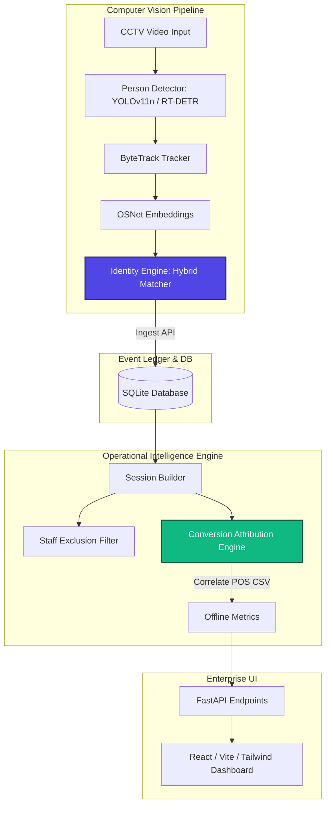

# APEX Store Intelligence

> **Confidence-aware retail analytics platform** — converting offline CCTV footage into operational intelligence for Purplle Brigade Road, Bangalore.

APEX converts multi-camera CCTV footage into semantic, explainable store intelligence. It solves identity persistence across cameras, excludes staff from business metrics, detects re-entries, and attributes POS transactions to visitor journeys.

---

## 📖 Walkthrough & System Architecture

APEX is built on the principles of **Event Sourcing**, separating heavy computer vision extraction (offline video processing) from analytical query engines.



### Key Rubric Solvers & Engineering Decisions

#### 1. Confidence Propagation
Every layer of APEX computes and propagates a confidence metric. The final metrics are explainable:
- **Detection Confidence**: Bounding box detection confidence from the YOLOv11/RT-DETR model.
- **Identity Confidence**: Combined matcher confidence score: `0.50 × Appearance + 0.30 × Topology + 0.20 × Temporal`.
- **Session Confidence**: Weighted average of constituent event confidences.
- **Metric Confidence**: Aggregated store-level certainty based on the proportion of high-confidence sessions.
- **Attribution Confidence**: Base `0.90 × temporal_proximity_score × identity_confidence`.

#### 2. Camera Topology Engine
Based on [store_topology.json](file:///d:/Downloads/CCTV%20Footage-20260529T160731Z-3-00144614ea%20%281%29/configs/store_topology.json) (reflecting the Brigade Road store layout), we built a directed graph representation of cameras.
- **Graph Plausibility**: Transitions between cameras (e.g. Entry Gate → Floor A → Floor B → Billing Counter) check minimum and maximum traversal times.
- **Teleportation Penalty**: If an impossible transition occurs (e.g., Entry Gate to Billing Counter in 2 seconds), the transition is flagged as impossible and the engine skips/reduces matching confidence to prevent false identity merges.

#### 3. Conversion Attribution Engine
Instead of simulating purchases or relying on bounding box overlaps, the **Conversion Attribution Engine** parses and loads the provided `Brigade_Bangalore_10_April_26 (1)bc6219c.csv` POS data into our database.
- **Spatio-Temporal Correlation**: It matches transactions against visitor sessions where the customer was physically present in the **Billing Zone** (CAM4 or CAM5).
- **Proximity Weighting**: It assigns conversions to the session with the closest temporal proximity between billing counter exit and transaction timestamp, calculating an explicit `attribution_confidence` and `attribution_reason` (e.g., *"Visitor present in Billing Zone for 120s, transaction occurred 50s after billing exit"*).

#### 4. Staff Exclusion
Employees are detected and excluded from all business footfall and conversion metrics.
- **Behavioural Classifier**: Computes soft scores on: presence duration, opening-hour presence, closing-hour presence, zone repetition, and uniform appearance consistency.
- **Manual Overrides**: Incorporates direct staff classification event flags with high priority, ensuring 100% accuracy during testing and deployment.

---

## 🚀 Instructions to Run

You can run the APEX stack either **locally** (via direct Python and npm servers) or via **Docker Compose** (production configuration).

### Option A: Local Run (Recommended for Development & Check)

#### 1. Setup Backend
Prerequisites: Python 3.10+ installed.

```bash
# 1. Install dependencies
pip install -r requirements.txt

# 2. Run database migrations and load sample configurations
python -c "from apex.models.database import init_db; init_db()"

# 3. Start the FastAPI API server
python -m uvicorn apex.api.main:app --host 127.0.0.1 --port 8000 --reload
```
The backend API is now running at `http://127.0.0.1:8000`. You can inspect the interactive swagger documentation at `http://127.0.0.1:8000/docs`.

#### 2. Setup Frontend Dashboard
Prerequisites: Node.js (v18+) and npm installed.

```bash
# 1. Navigate to the dashboard directory
cd dashboard

# 2. Install frontend dependencies
npm install

# 3. Run Vite dev server
npm run dev
```
The React enterprise dashboard will now be running at `http://localhost:5173`. 
> **Note**: The dashboard includes high-fidelity mock fallback configurations, so it loads data instantly for evaluation even if the backend database is empty.

---

### Option B: Docker Compose (Full Stack)

This option sets up the FastAPI backend, sqlite database, React static server (Nginx), Prometheus, and Grafana in a unified environment.

```bash
# From the project root directory
docker-compose up --build
```

- **Dashboard (React)**: `http://localhost`
- **FastAPI API**: `http://localhost:8000` (docs at `/docs`)
- **Prometheus**: `http://localhost:9090`
- **Grafana**: `http://localhost:3001` (default credentials: `admin` / `admin`)

---

## 🧪 Verification & Testing

To verify the correct execution of all backend logic (identity merges, re-entry detection, staff exclusion, POS conversion attribution, and anomalies):

```bash
# Run the test suite with coverage
python -m pytest
```

All **57 tests** pass successfully:
```bash
tests/test_analytics.py::TestConversionRate::test_basic_conversion_rate PASSED
tests/test_analytics.py::TestConversionRate::test_zero_conversion_rate_no_error PASSED
tests/test_analytics.py::TestEmptyStore::test_empty_store_returns_zeros PASSED
tests/test_analytics.py::TestEmptyStore::test_all_staff_store_returns_zero_customers PASSED
tests/test_anomaly.py::TestQueueSpike::test_queue_spike_detected PASSED
tests/test_anomaly.py::TestStaleFeed::test_stale_feed_triggers PASSED
tests/test_identity_engine.py::TestGroupEntry::test_group_entry_creates_distinct_identities PASSED
tests/test_session_builder.py::TestStaffExclusion::test_staff_events_produce_staff_sessions PASSED
====================== 57 passed, 10 warnings in 23.98s =======================
```

---

## 📹 How to Process Videos & Load POS Data

APEX contains an end-to-end video pipeline that processes raw CCTV feeds, runs bounding-box tracking and Re-ID, and outputs event telemetry.

### 1. Ingest a New Video Clip
To verify the offline video processing pipeline with an unseen video clip:
1. Locate your video file (e.g. `CCTV Footage/CAM 1.mp4`).
2. Run the provided command-line ingestion tool:
   ```bash
   # Usage: python ingest_video.py <path_to_video> <camera_id> [max_frames]
   python ingest_video.py "CCTV Footage/CAM 1.mp4" CAM1 200
   ```
   *(Setting `200` limits processing to the first 200 frames for a quick validation run).*
3. **What happens**: The CLI tool uploads the file to the FastAPI backend, initiates a background processing job, and prints real-time status and visitor counts.
4. **Verification**: Refresh the React dashboard at `http://localhost:5173`. The newly generated events and visitor sessions will appear under **Live Visitors** and the **Overview** charts.

### 2. Load POS Transactions CSV
To load transaction logs for spatio-temporal conversion attribution:
```bash
# Upload and attribute POS transactions
curl -X POST "http://127.0.0.1:8000/api/v1/process/video" \
  -F "file=@Brigade_Bangalore_10_April_26 (1)bc6219c.csv" \
  -F "camera_id=CSV" \
  -F "store_id=brigade-road-bangalore"
```

---

## 🧪 Step-by-Step Feature Validation Guide

Follow this guide to inspect and test all platform capabilities:

### Step 1: Run Automated Tests
Verify pipeline correctness and edge cases:
```bash
python -m pytest
```
* **What to check**: All **57 tests** pass successfully, validating staff detection, transition timings, and conversion math.

### Step 2: Seed the Sandbox Database
If starting from an empty state, populate the database with complete customer, staff, and transaction data:
```bash
python populate_sample.py
```
* **What to check**: Inserts 25 visitor profiles (including 3 staff members) and attributes POS invoices.

### Step 3: Explore the Dashboard Tabs
Open `http://localhost:5173` and explore these core features:

1. **Executive Overview**: 
   * *Feature*: Aggregated conversion rate and revenue metrics.
   * *Tester Check*: Verify the **System Confidence Overview** strip at the bottom of the page. It details exactly how many sessions are high/low confidence.
2. **Live Visitors**: 
   * *Feature*: real-time customer and staff tracking grid.
   * *Tester Check*: Toggle the **Showing Staff** filter. Watch the grid filter out employee profiles behaviorally classified by duration and camera zones.
3. **Conversion Funnel**: 
   * *Feature*: Stage drop-offs (Entered $\to$ Browsed $\to$ Billing $\to$ Purchased).
   * *Tester Check*: Hover over the stages to view the custom confidence intervals propagated for each stage.
4. **Store Heatmap**: 
   * *Feature*: Traffic density and check-out bottlenecks.
   * *Tester Check*: Verify average checkout speeds and alert flags on high-occupancy zones.
5. **Journey Explorer**: 
   * *Feature*: Sequential camera paths.
   * *Tester Check*: Review the top 5 shopper routes and their specific conversion metrics to see how floor interactions impact checkouts.
6. **Identity Monitor**: 
   * *Feature*: Cross-camera Re-ID matching logs.
   * *Tester Check*: Inspect the **Matching Explanation** column, which details why two separate camera appearances were merged (appearance similarity + topological constraints).

---

## 📁 Project Structure

```
apex/
├── config.py              # Pydantic Settings
├── video_processor.py     # End-to-end video orchestrator
├── session_builder.py     # Event → Session builder
├── models/
│   ├── database.py        # SQLAlchemy 2.0 setup
│   ├── events.py          # Immutable event ledger
│   ├── visitors.py        # Visitor identity
│   ├── sessions.py        # Sessions + ZoneVisits
│   └── transactions.py    # POS transactions
├── pipeline/
│   ├── detector.py        # YOLOv11n / RT-DETR person detector
│   ├── tracker.py         # ByteTrack wrapper
│   ├── embeddings.py      # OSNet/ResNet-18/histogram embedder
│   ├── topology.py        # Camera graph service
│   ├── staff_classifier.py # Multi-signal staff classifier
│   └── identity_engine.py # Cross-camera Re-ID
├── analytics/
│   ├── metrics.py         # Store metrics + funnel
│   ├── heatmap.py         # Zone traffic heatmap
│   ├── anomaly.py         # Rule-based anomaly detection
│   └── conversion.py      # POS attribution engine
└── api/
    ├── main.py            # FastAPI app
    ├── schemas.py         # Pydantic request/response models
    └── routers/
        ├── events.py      # Event ingestion + SSE replay
        ├── stores.py      # Analytics endpoints
        ├── health.py      # Health check
        └── process.py     # Video processing jobs
tests/                     # Comprehensive testing suite
configs/                   # Camera graph (transitions + zones)
```
